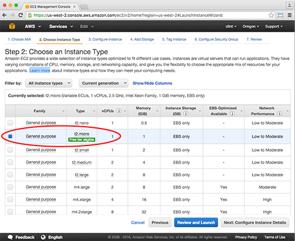
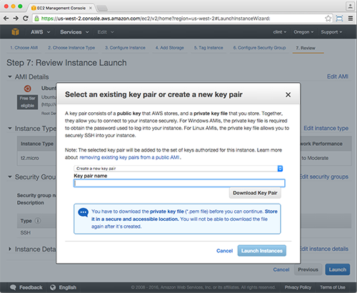
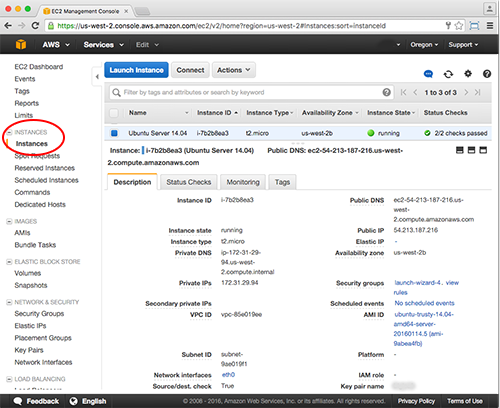
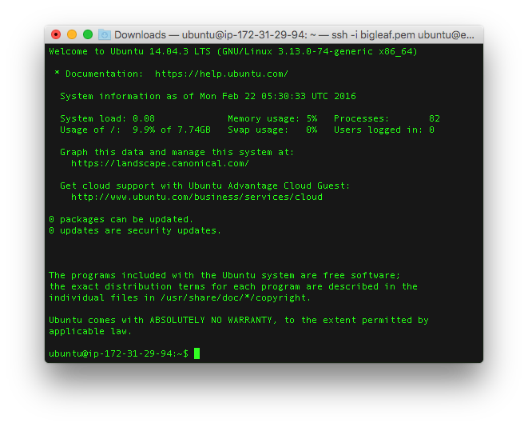

# Server Side Swift: Installing on Ubuntu Server 14.04 using Amazon Web Services EC2

This repo is a Step-by-Step Guide for:
* Standing up an Ubuntu Server (14.04) using Amazon Web Services [(AWS)](https://aws.amazon.com/) - Elastic Compute Cloud [(EC2).](https://aws.amazon.com/ec2/?nc2=h_l3_c)
* Installing [Swift](https://developer.apple.com/swift/) on Ubuntu Server. 
* Playing with Server Side Swift via the [Swift REPL](https://developer.apple.com/swift/blog/?id=18).


### Step 1: Create an EC2 Server Instance (Ubuntu Server 14.04)

* To create an Ubuntu Server on AWS - EC2, you must first sign up for an AWS account [here](https://aws.amazon.com/premiumsupport/signup/).

* Once you have an account, go to the [AWS Management Console](https://aws.amazon.com/console/) and login.

* Launch the EC2 Dashboard by clicking on __EC2 Virtual Servers in the Cloud__ (see screenshot below).


* In the __EC2 Dashboard__, click the __Launch Instance__ button (see screenshot below).


* Choose the Amazon Machine Image (AMI) named __Ubuntu Server 14.04 LTS (HVM), SSD Volume Type - ami-9abea4fb__ (see screenshot below).


* Choose an Instance Type.  You can learn more about different EC2 Instance types [here](https://aws.amazon.com/ec2/instance-types/). Note, as you increase the properties of your instance (e.g. increase CPU, Memory, etc.) you will be charged more per hour.  We will choose the Type: __t2.micro__ (see screenshot below).  Proceed by clicking the __Review and Launch__ button.



* Review the EC2 Instance details then click the __Launch__ button.  You will be prompted to select an existing key pair or create a new one.  Note, a key pair is __required__ to connect to your server.  If you don't have one, choose __Create a new key pair__.  Provide a name (e.g. UbuntuSwiftKey) and click the __Download Key Pair__ button.  After your keypair is downloaded (it has a .pem file extension), click the __Launch Instance__ button (see screenshot below).  



* Return to the __EC2 Dashboard__ and click on the __Instances__ section on the left (see screenshow below).  Wait a few mintues for your Instance State to be __running__ and the Status Checks to list __2/2 checks passed__.  Before you connect to your Ubuntu Server, take note of the Public DNS.  For example, it will resemble the following __ec2-54-213-187-216.us-west-2.compute.amazonaws.com__.  



* Navigate to your key pair.  Use Terminal to navigate to your key pair (e.g. UbuntuSwiftKey.pem file).  For example, if your key pair is in your Downloads folder you would execute.

````
    $ cd ~/Downloads
````

* Change Access Permissions.  Using Terminal, use the __chmod__ command to make sure your key pair isn't publicly viewable.  For example, if your key pair is called UbuntuSwiftKey.pem you would execute:

````
    $ chmod 400 UbuntuSwiftKey.pem
````


* Connect to Ubuntu Server.  Using Terminal, connect to your server via SSH with the following command below:

````
    $ ssh -i [MyKeyPair].pem ubuntu@[MyPublicDNS]
````

For example, if your key pair is called __UbuntuSwiftKey.pem__ and your Ubuntu Server's Public DNS is __ec2-54-213-187-216.us-west-2.compute.amazonaws.com__.  Then you can connect with the following:

````
    $ ssh -i UbuntuSwiftKey.pem ubuntu@ec2-54-213-187-216.us-west-2.compute.amazonaws.com
````

* Confirm that you have successfully connected (see screenshot below).



You just completed the first step - standing up an Ubuntu Server using Amazon Web Services - Elastic Computing Cloud (EC2).  In the next step, you will install __Swift on the Server__!!!

Note, other things you may consider that we have not covered here:
* Updating your Security Group to only allow connections from your computer. [Read about it here](http://docs.aws.amazon.com/AWSEC2/latest/UserGuide/authorizing-access-to-an-instance.html).
* Assinging an Elastic IP Address to your EC2 instance. [Read about it here](http://docs.aws.amazon.com/AmazonVPC/latest/GettingStartedGuide/getting-started-assign-eip.html).

### Step 2: Install Swift on Ubuntu Server

* If needed, connect to your Ubuntu Server via SSH using Terminal (see above).

* Install dependencies

````
    $ sudo apt-get update
    $ sudo apt-get install clang
````

* For quickness and ease, we will start by using an Apple provided snapshot of Swift that we can install on Ubuntu Server 14.04.  View the Latest Swift snapshots [here](https://swift.org/download/#latest-development-snapshots).  Copy the url for the Ubuntu 14.04 snapshot.  

* Download the target snapshot from Apple using the wget command. 

````
    $ wget [your-target-Swift-snapshot]

    For example:
    $ wget https://swift.org/builds/development/ubuntu1404/swift-DEVELOPMENT-SNAPSHOT-2016-02-25-a/swift-DEVELOPMENT-SNAPSHOT-2016-02-25-a-ubuntu14.04.tar.gz
````

* Extract the snapshot using the tar command.

````
    $ tar -xvzf [your-swift-snapshot]

    For example:
    $ tar -xvzf swift-DEVELOPMENT-SNAPSHOT-2016-02-25-a-ubuntu14.04.tar.gz
````

* Update the PATH environment variable.

````
    $ export PATH=/path/to/Swift/usr/bin:"${PATH}"

    For example:
    $ cd swift-DEVELOPMENT-SNAPSHOT-2016-02-25-a-ubuntu14.04/usr/bin
    $ pwd
    $ export PATH=/home/ubuntu/swift-DEVELOPMENT-SNAPSHOT-2016-02-25-a-ubuntu14.04/usr/bin:$PATH
````

* Confirm the Swift snapshot is running.

````
    $ swift --version
````

### Step 3: Playing with Server Side Swift using the Swift REPL

* In Terminal, launch the __Read Eval Print Loop (i.e. REPL)__ by executing the swift command.  This will let us play with Swift on the Server via Terminal.

````
    $ swift
````

* Create a constant.

````
    $ let targetServer = "Ubuntu 14.04"
````

* Create a print statement.

````
    $ print("Hello Server Side Swift on \(targetServer)")
````

* You should see __Hello Server Side Swift on Ubuntu 14.04__

* Exit the REPL.

````
    $ q: 
````

### Clean Up

* To exit from your SSH connection to your Ubuntu Server, simply do:

````
    $ exit
````

* To terminate your AWS Ubuntu Server, [see here.](http://docs.aws.amazon.com/AWSEC2/latest/UserGuide/terminating-instances.html)

### Connect
* Twitter: [@clintcabanero](http://twitter.com/clintcabanero)
* GitHub: [ccabanero](http:///github.com/ccabanero)
