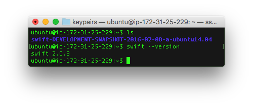
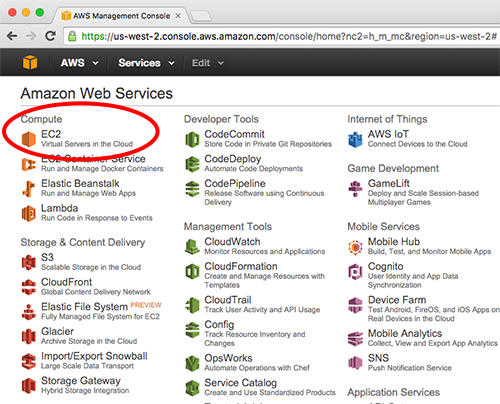
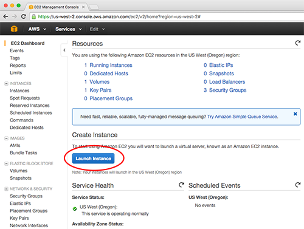
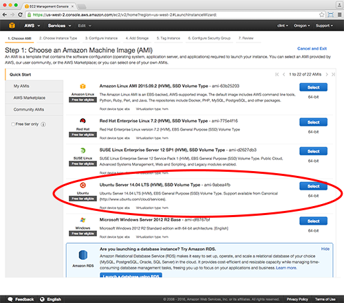

# Installing Server Side Swift on AWS
This repo is a Step-by-Step Guide for:
* Standing up an Ubuntu Server (14.04) using Amazon Web Services [(AWS)](https://aws.amazon.com/) - Elastic Compute Cloud [(EC2).](https://aws.amazon.com/ec2/?nc2=h_l3_c)
* Installing Swift on Ubuntu Server. 
* Installing a Server-side framework called [Perfect](http://perfect.org/) for authoring Web Services using [Swift](https://developer.apple.com/swift/).

### Step 1: Create an EC2 Server Instance (Ubuntu 14.04)

* To create an Ubuntu Server on AWS - EC2, you must first sign up for an AWS account [here](https://aws.amazon.com/premiumsupport/signup/).

* Once you have an account, go to the [AWS Management Console](https://aws.amazon.com/console/) and login.

* Launch the EC2 Dashboard by clicking on __EC2 Virtual Servers in the Cloud__ (see screenshot below).

* In the __EC2 Dashboard__, click the __Launch Instance__ button (see screenshot below).

* Choose the Amazon Machine Image (AMI) named __Ubuntu Server 14.04 LTS (HVM), SSD Volume Type - ami-9abea4fb__ (see screenshot below).

### Step 2: Install Swift on Ubuntu Server

### Step 3: Install Server-side Framework for Creating Web Services using Swift (Perfect)

### Connect
* Twitter: [@clintcabanero](http://twitter.com/clintcabanero)
* GitHub: [ccabanero](http:///github.com/ccabanero)
